# DIAGRAMAS UML - TaskFlow Lite UNPHU
## Código Mermaid para Visualización

> **Nota:** Para visualizar estos diagramas, copia el código y pégalo en:
> - https://mermaid.live/
> - VS Code con extensión Mermaid
> - Cualquier editor que soporte Mermaid

---

# 4.4 DIAGRAMAS UML

---

## 4.4.1 Mapa Conceptual

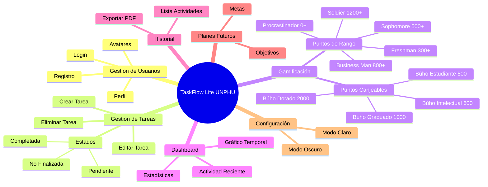
```mermaid
mindmap
  root((TaskFlow Lite UNPHU))
    Gestión de Usuarios
      Registro
      Login
      Perfil
      Avatares
    Gestión de Tareas
      Crear Tarea
      Editar Tarea
      Eliminar Tarea
      Estados
        Pendiente
        Completada
        No Finalizada
    Gamificación
      Puntos de Rango
        Procrastinador 0+
        Freshman 300+
        Sophomore 500+
        Business Man 800+
        Soldier 1200+
      Puntos Canjeables
        Búho Estudiante 500
        Búho Intelectual 600
        Búho Graduado 1000
        Búho Dorado 2000
    Dashboard
      Estadísticas
      Gráfico Temporal
      Actividad Reciente
    Historial
      Lista Actividades
      Exportar PDF
    Planes Futuros
      Metas
      Objetivos
    Configuración
      Modo Oscuro
      Modo Claro
```

---

## 4.4.2 Diagramas de Casos de Uso

### Diagrama General de Casos de Uso

```mermaid
flowchart TB
    subgraph Sistema["🎓 TaskFlow Lite - UNPHU"]
        UC1([Registrarse])
        UC2([Iniciar Sesión])
        UC3([Cerrar Sesión])
        UC4([Crear Tarea])
        UC5([Editar Tarea])
        UC6([Eliminar Tarea])
        UC7([Cambiar Estado Tarea])
        UC8([Ver Dashboard])
        UC9([Ver Historial])
        UC10([Exportar PDF])
        UC11([Crear Plan Futuro])
        UC12([Editar Plan])
        UC13([Eliminar Plan])
        UC14([Ver Perfil])
        UC15([Desbloquear Avatar])
        UC16([Seleccionar Avatar])
        UC17([Cambiar Tema])
        UC18([Ver Gráfico Desempeño])
    end

    Usuario((👤 Estudiante))
    
    Usuario --> UC1
    Usuario --> UC2
    Usuario --> UC3
    Usuario --> UC4
    Usuario --> UC5
    Usuario --> UC6
    Usuario --> UC7
    Usuario --> UC8
    Usuario --> UC9
    Usuario --> UC10
    Usuario --> UC11
    Usuario --> UC12
    Usuario --> UC13
    Usuario --> UC14
    Usuario --> UC15
    Usuario --> UC16
    Usuario --> UC17
    Usuario --> UC18
```

### Caso de Uso: Gestión de Tareas (Detallado)

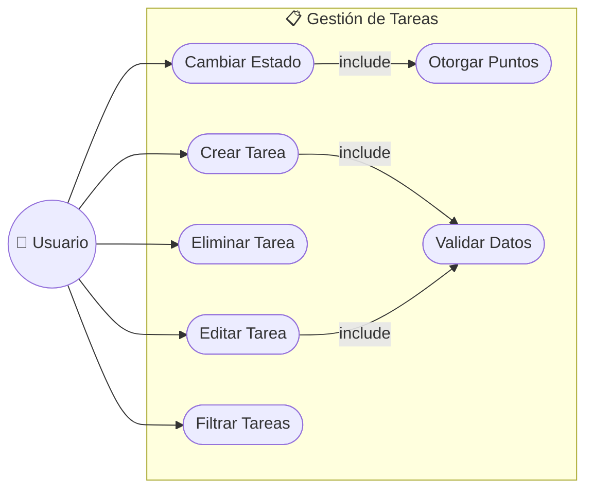
```mermaid
flowchart LR
    subgraph Tareas["📋 Gestión de Tareas"]
        CT([Crear Tarea])
        ET([Editar Tarea])
        DT([Eliminar Tarea])
        CE([Cambiar Estado])
        FT([Filtrar Tareas])
        
        CE --> |include| OTP([Otorgar Puntos])
        CT --> |include| VAL([Validar Datos])
        ET --> |include| VAL
    end
    
    U((👤 Usuario)) --> CT
    U --> ET
    U --> DT
    U --> CE
    U --> FT
```

### Caso de Uso: Sistema de Gamificación

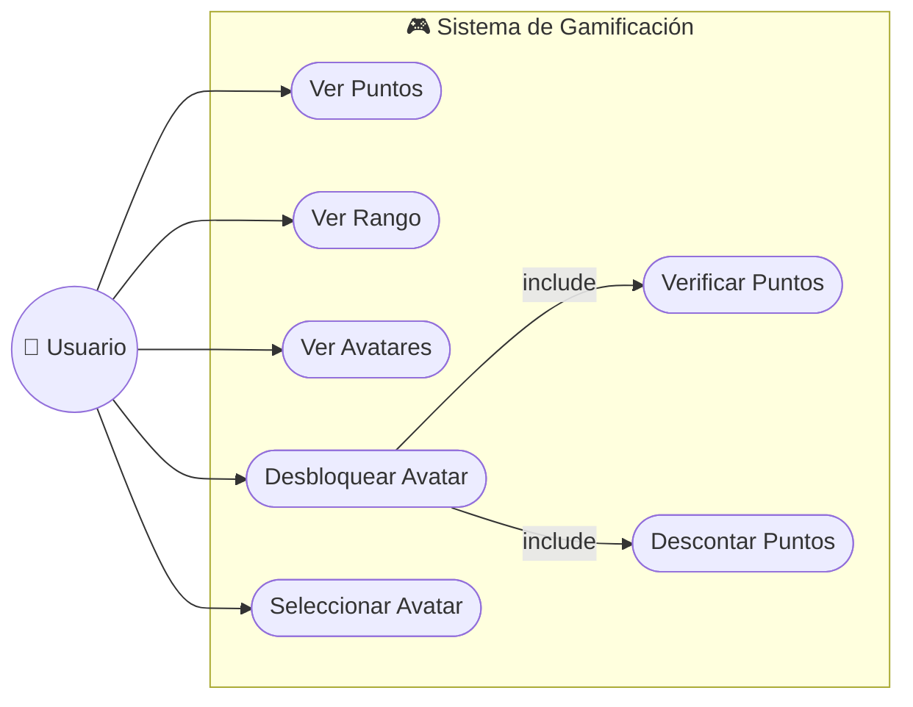
```mermaid
flowchart LR
    subgraph Gamificacion["🎮 Sistema de Gamificación"]
        VP([Ver Puntos])
        VR([Ver Rango])
        VA([Ver Avatares])
        DA([Desbloquear Avatar])
        SA([Seleccionar Avatar])
        
        DA --> |include| VPT([Verificar Puntos])
        DA --> |include| DP([Descontar Puntos])
    end
    
    U((👤 Usuario)) --> VP
    U --> VR
    U --> VA
    U --> DA
    U --> SA
```

---

## 4.4.3 Diagrama de Actividades

### Actividad: Completar una Tarea

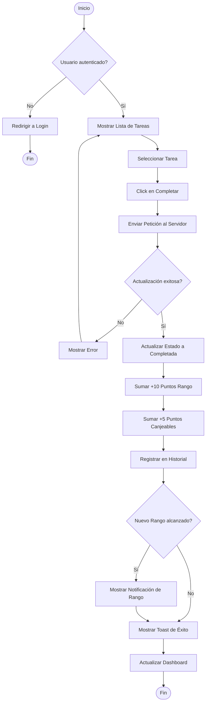
```mermaid
flowchart TD
    A([Inicio]) --> B{Usuario autenticado?}
    B -->|No| C[Redirigir a Login]
    C --> D([Fin])
    B -->|Sí| E[Mostrar Lista de Tareas]
    E --> F[Seleccionar Tarea]
    F --> G[Click en Completar]
    G --> H[Enviar Petición al Servidor]
    H --> I{Actualización exitosa?}
    I -->|No| J[Mostrar Error]
    J --> E
    I -->|Sí| K[Actualizar Estado a Completada]
    K --> L[Sumar +10 Puntos Rango]
    L --> M[Sumar +5 Puntos Canjeables]
    M --> N[Registrar en Historial]
    N --> O{Nuevo Rango alcanzado?}
    O -->|Sí| P[Mostrar Notificación de Rango]
    O -->|No| Q[Mostrar Toast de Éxito]
    P --> Q
    Q --> R[Actualizar Dashboard]
    R --> S([Fin])
```

### Actividad: Registro de Usuario

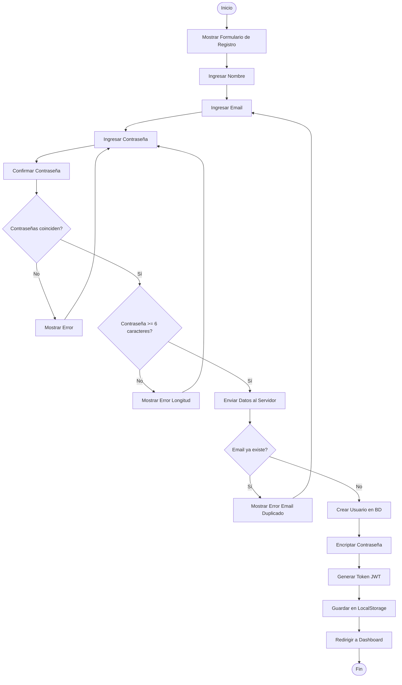
```mermaid
flowchart TD
    A([Inicio]) --> B[Mostrar Formulario de Registro]
    B --> C[Ingresar Nombre]
    C --> D[Ingresar Email]
    D --> E[Ingresar Contraseña]
    E --> F[Confirmar Contraseña]
    F --> G{Contraseñas coinciden?}
    G -->|No| H[Mostrar Error]
    H --> E
    G -->|Sí| I{Contraseña >= 6 caracteres?}
    I -->|No| J[Mostrar Error Longitud]
    J --> E
    I -->|Sí| K[Enviar Datos al Servidor]
    K --> L{Email ya existe?}
    L -->|Sí| M[Mostrar Error Email Duplicado]
    M --> D
    L -->|No| N[Crear Usuario en BD]
    N --> O[Encriptar Contraseña]
    O --> P[Generar Token JWT]
    P --> Q[Guardar en LocalStorage]
    Q --> R[Redirigir a Dashboard]
    R --> S([Fin])
```

### Actividad: Desbloquear Avatar

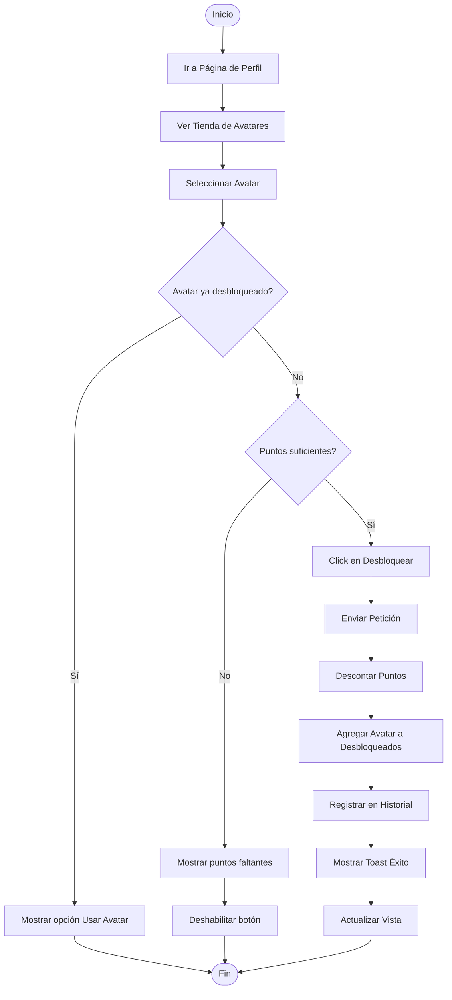
```mermaid
flowchart TD
    A([Inicio]) --> B[Ir a Página de Perfil]
    B --> C[Ver Tienda de Avatares]
    C --> D[Seleccionar Avatar]
    D --> E{Avatar ya desbloqueado?}
    E -->|Sí| F[Mostrar opción Usar Avatar]
    F --> G([Fin])
    E -->|No| H{Puntos suficientes?}
    H -->|No| I[Mostrar puntos faltantes]
    I --> J[Deshabilitar botón]
    J --> G
    H -->|Sí| K[Click en Desbloquear]
    K --> L[Enviar Petición]
    L --> M[Descontar Puntos]
    M --> N[Agregar Avatar a Desbloqueados]
    N --> O[Registrar en Historial]
    O --> P[Mostrar Toast Éxito]
    P --> Q[Actualizar Vista]
    Q --> G
```

---

## 4.4.4 Diagrama Entidad-Relación

### Diagrama ER Completo

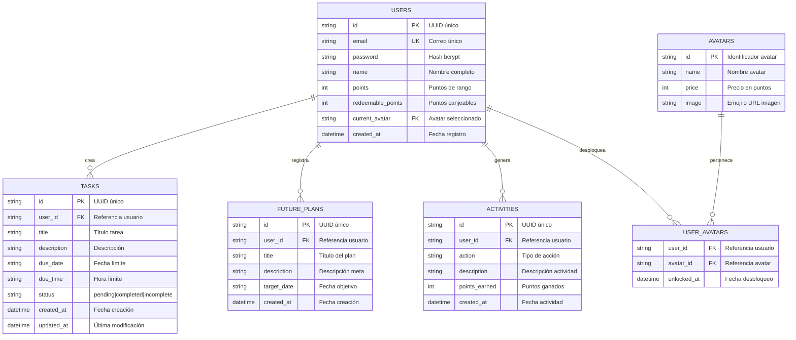
```mermaid
erDiagram
    USERS ||--o{ TASKS : "crea"
    USERS ||--o{ FUTURE_PLANS : "registra"
    USERS ||--o{ ACTIVITIES : "genera"
    USERS ||--o{ USER_AVATARS : "desbloquea"
    AVATARS ||--o{ USER_AVATARS : "pertenece"

    USERS {
        string id PK "UUID único"
        string email UK "Correo único"
        string password "Hash bcrypt"
        string name "Nombre completo"
        int points "Puntos de rango"
        int redeemable_points "Puntos canjeables"
        string current_avatar FK "Avatar seleccionado"
        datetime created_at "Fecha registro"
    }

    TASKS {
        string id PK "UUID único"
        string user_id FK "Referencia usuario"
        string title "Título tarea"
        string description "Descripción"
        string due_date "Fecha límite"
        string due_time "Hora límite"
        string status "pending|completed|incomplete"
        datetime created_at "Fecha creación"
        datetime updated_at "Última modificación"
    }

    FUTURE_PLANS {
        string id PK "UUID único"
        string user_id FK "Referencia usuario"
        string title "Título del plan"
        string description "Descripción meta"
        string target_date "Fecha objetivo"
        datetime created_at "Fecha creación"
    }

    ACTIVITIES {
        string id PK "UUID único"
        string user_id FK "Referencia usuario"
        string action "Tipo de acción"
        string description "Descripción actividad"
        int points_earned "Puntos ganados"
        datetime created_at "Fecha actividad"
    }

    AVATARS {
        string id PK "Identificador avatar"
        string name "Nombre avatar"
        int price "Precio en puntos"
        string image "Emoji o URL imagen"
    }

    USER_AVATARS {
        string user_id FK "Referencia usuario"
        string avatar_id FK "Referencia avatar"
        datetime unlocked_at "Fecha desbloqueo"
    }
```

### Diagrama ER Simplificado

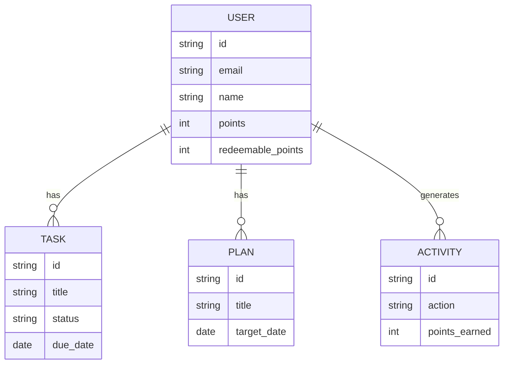
```mermaid
erDiagram
    USER ||--o{ TASK : has
    USER ||--o{ PLAN : has
    USER ||--o{ ACTIVITY : generates
    
    USER {
        string id
        string email
        string name
        int points
        int redeemable_points
    }
    
    TASK {
        string id
        string title
        string status
        date due_date
    }
    
    PLAN {
        string id
        string title
        date target_date
    }
    
    ACTIVITY {
        string id
        string action
        int points_earned
    }
```

---

## 4.4.5 Diagramas de Flujo

### Flujo: Proceso de Login

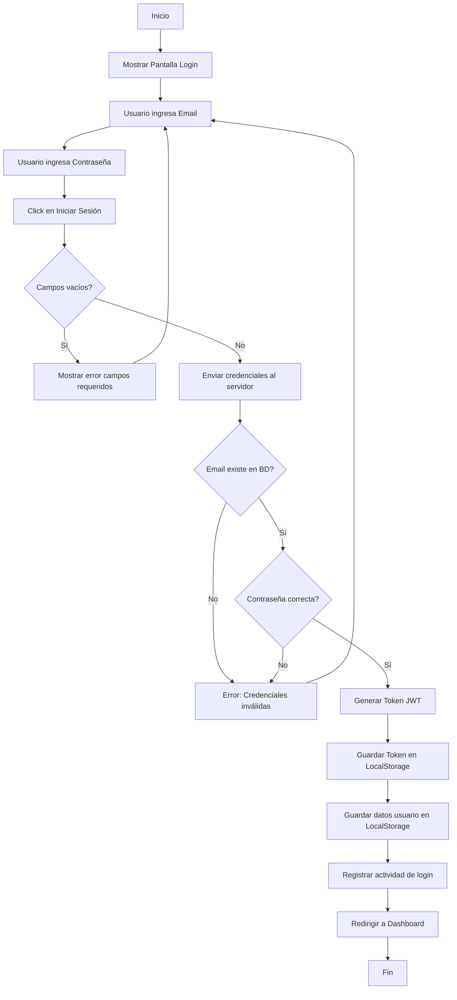
```mermaid
flowchart TD
    A[Inicio] --> B[Mostrar Pantalla Login]
    B --> C[Usuario ingresa Email]
    C --> D[Usuario ingresa Contraseña]
    D --> E[Click en Iniciar Sesión]
    E --> F{Campos vacíos?}
    F -->|Sí| G[Mostrar error campos requeridos]
    G --> C
    F -->|No| H[Enviar credenciales al servidor]
    H --> I{Email existe en BD?}
    I -->|No| J[Error: Credenciales inválidas]
    J --> C
    I -->|Sí| K{Contraseña correcta?}
    K -->|No| J
    K -->|Sí| L[Generar Token JWT]
    L --> M[Guardar Token en LocalStorage]
    M --> N[Guardar datos usuario en LocalStorage]
    N --> O[Registrar actividad de login]
    O --> P[Redirigir a Dashboard]
    P --> Q[Fin]
```

### Flujo: Creación de Tarea

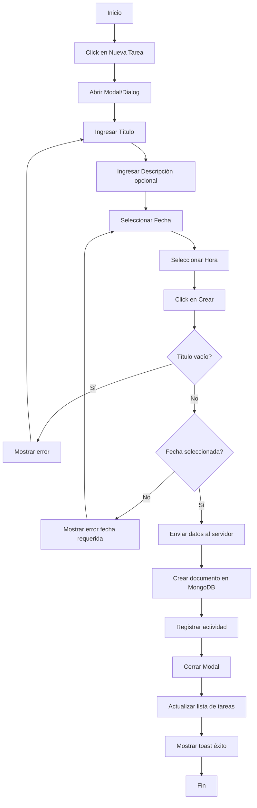
```mermaid
flowchart TD
    A[Inicio] --> B[Click en Nueva Tarea]
    B --> C[Abrir Modal/Dialog]
    C --> D[Ingresar Título]
    D --> E[Ingresar Descripción opcional]
    E --> F[Seleccionar Fecha]
    F --> G[Seleccionar Hora]
    G --> H[Click en Crear]
    H --> I{Título vacío?}
    I -->|Sí| J[Mostrar error]
    J --> D
    I -->|No| K{Fecha seleccionada?}
    K -->|No| L[Mostrar error fecha requerida]
    L --> F
    K -->|Sí| M[Enviar datos al servidor]
    M --> N[Crear documento en MongoDB]
    N --> O[Registrar actividad]
    O --> P[Cerrar Modal]
    P --> Q[Actualizar lista de tareas]
    Q --> R[Mostrar toast éxito]
    R --> S[Fin]
```

### Flujo: Exportar Historial a PDF

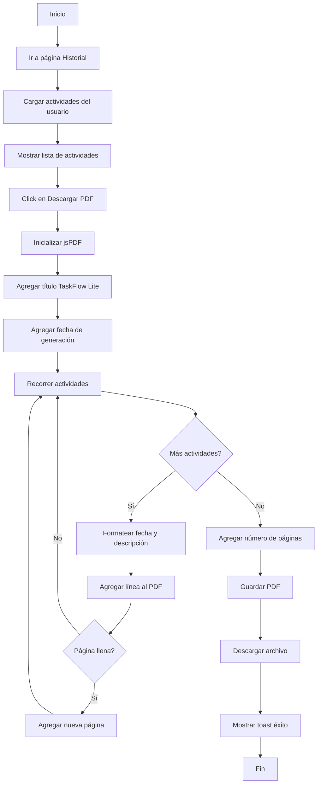
```mermaid
flowchart TD
    A[Inicio] --> B[Ir a página Historial]
    B --> C[Cargar actividades del usuario]
    C --> D[Mostrar lista de actividades]
    D --> E[Click en Descargar PDF]
    E --> F[Inicializar jsPDF]
    F --> G[Agregar título TaskFlow Lite]
    G --> H[Agregar fecha de generación]
    H --> I[Recorrer actividades]
    I --> J{Más actividades?}
    J -->|Sí| K[Formatear fecha y descripción]
    K --> L[Agregar línea al PDF]
    L --> M{Página llena?}
    M -->|Sí| N[Agregar nueva página]
    N --> I
    M -->|No| I
    J -->|No| O[Agregar número de páginas]
    O --> P[Guardar PDF]
    P --> Q[Descargar archivo]
    Q --> R[Mostrar toast éxito]
    R --> S[Fin]
```

### Flujo: Cambio de Tema

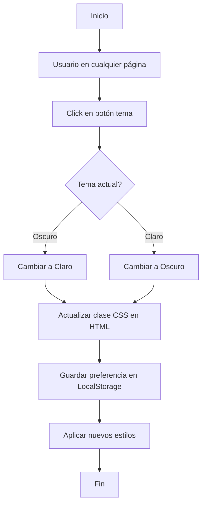
```mermaid
flowchart TD
    A[Inicio] --> B[Usuario en cualquier página]
    B --> C[Click en botón tema]
    C --> D{Tema actual?}
    D -->|Oscuro| E[Cambiar a Claro]
    D -->|Claro| F[Cambiar a Oscuro]
    E --> G[Actualizar clase CSS en HTML]
    F --> G
    G --> H[Guardar preferencia en LocalStorage]
    H --> I[Aplicar nuevos estilos]
    I --> J[Fin]
```

---

## 4.4.6 Diagramas de Secuencia

### Secuencia: Registro de Usuario

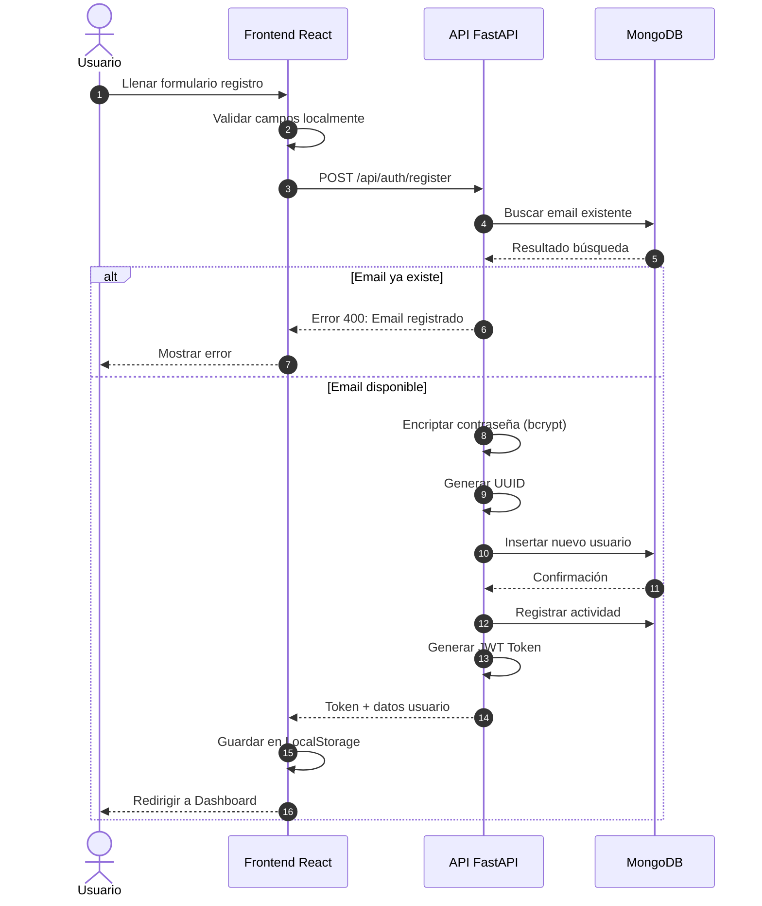
```mermaid
sequenceDiagram
    autonumber
    actor U as Usuario
    participant F as Frontend React
    participant A as API FastAPI
    participant DB as MongoDB

    U->>F: Llenar formulario registro
    F->>F: Validar campos localmente
    F->>A: POST /api/auth/register
    A->>DB: Buscar email existente
    DB-->>A: Resultado búsqueda
    
    alt Email ya existe
        A-->>F: Error 400: Email registrado
        F-->>U: Mostrar error
    else Email disponible
        A->>A: Encriptar contraseña (bcrypt)
        A->>A: Generar UUID
        A->>DB: Insertar nuevo usuario
        DB-->>A: Confirmación
        A->>DB: Registrar actividad
        A->>A: Generar JWT Token
        A-->>F: Token + datos usuario
        F->>F: Guardar en LocalStorage
        F-->>U: Redirigir a Dashboard
    end
```

### Secuencia: Completar Tarea

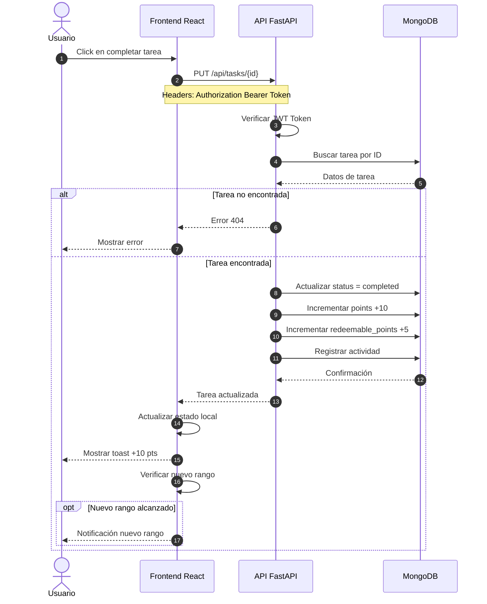
```mermaid
sequenceDiagram
    autonumber
    actor U as Usuario
    participant F as Frontend React
    participant A as API FastAPI
    participant DB as MongoDB

    U->>F: Click en completar tarea
    F->>A: PUT /api/tasks/{id}
    Note over F,A: Headers: Authorization Bearer Token
    A->>A: Verificar JWT Token
    A->>DB: Buscar tarea por ID
    DB-->>A: Datos de tarea
    
    alt Tarea no encontrada
        A-->>F: Error 404
        F-->>U: Mostrar error
    else Tarea encontrada
        A->>DB: Actualizar status = completed
        A->>DB: Incrementar points +10
        A->>DB: Incrementar redeemable_points +5
        A->>DB: Registrar actividad
        DB-->>A: Confirmación
        A-->>F: Tarea actualizada
        F->>F: Actualizar estado local
        F-->>U: Mostrar toast +10 pts
        F->>F: Verificar nuevo rango
        
        opt Nuevo rango alcanzado
            F-->>U: Notificación nuevo rango
        end
    end
```

### Secuencia: Desbloquear Avatar

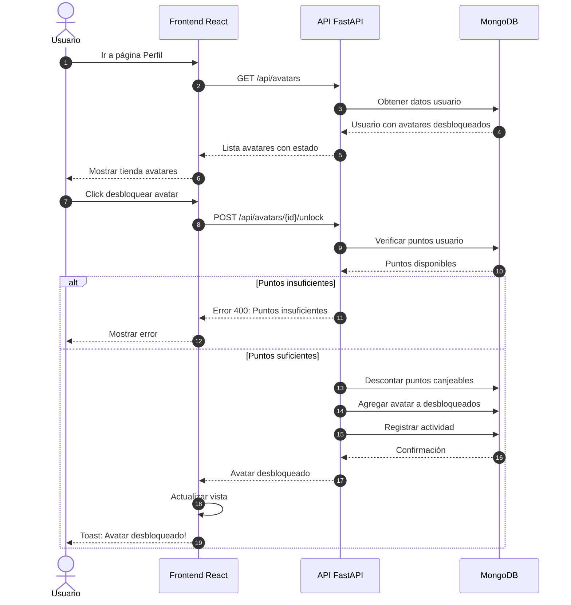
```mermaid
sequenceDiagram
    autonumber
    actor U as Usuario
    participant F as Frontend React
    participant A as API FastAPI
    participant DB as MongoDB

    U->>F: Ir a página Perfil
    F->>A: GET /api/avatars
    A->>DB: Obtener datos usuario
    DB-->>A: Usuario con avatares desbloqueados
    A-->>F: Lista avatares con estado
    F-->>U: Mostrar tienda avatares

    U->>F: Click desbloquear avatar
    F->>A: POST /api/avatars/{id}/unlock
    A->>DB: Verificar puntos usuario
    DB-->>A: Puntos disponibles
    
    alt Puntos insuficientes
        A-->>F: Error 400: Puntos insuficientes
        F-->>U: Mostrar error
    else Puntos suficientes
        A->>DB: Descontar puntos canjeables
        A->>DB: Agregar avatar a desbloqueados
        A->>DB: Registrar actividad
        DB-->>A: Confirmación
        A-->>F: Avatar desbloqueado
        F->>F: Actualizar vista
        F-->>U: Toast: Avatar desbloqueado!
    end
```

### Secuencia: Ver Dashboard con Gráfico

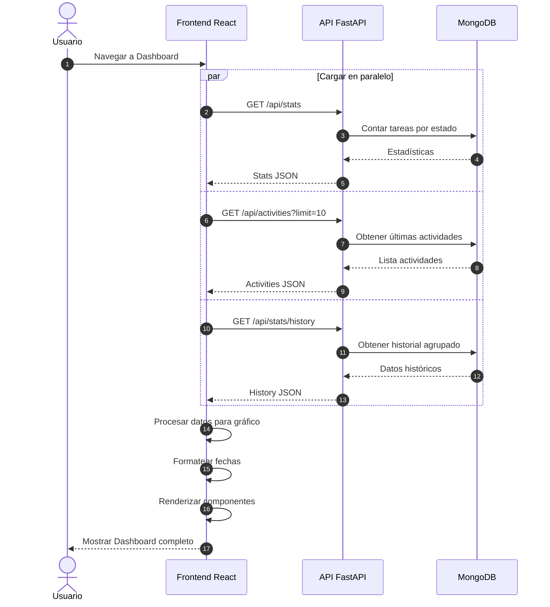
```mermaid
sequenceDiagram
    autonumber
    actor U as Usuario
    participant F as Frontend React
    participant A as API FastAPI
    participant DB as MongoDB

    U->>F: Navegar a Dashboard
    
    par Cargar en paralelo
        F->>A: GET /api/stats
        A->>DB: Contar tareas por estado
        DB-->>A: Estadísticas
        A-->>F: Stats JSON
    and
        F->>A: GET /api/activities?limit=10
        A->>DB: Obtener últimas actividades
        DB-->>A: Lista actividades
        A-->>F: Activities JSON
    and
        F->>A: GET /api/stats/history
        A->>DB: Obtener historial agrupado
        DB-->>A: Datos históricos
        A-->>F: History JSON
    end

    F->>F: Procesar datos para gráfico
    F->>F: Formatear fechas
    F->>F: Renderizar componentes
    F-->>U: Mostrar Dashboard completo
```

### Secuencia: Exportar PDF

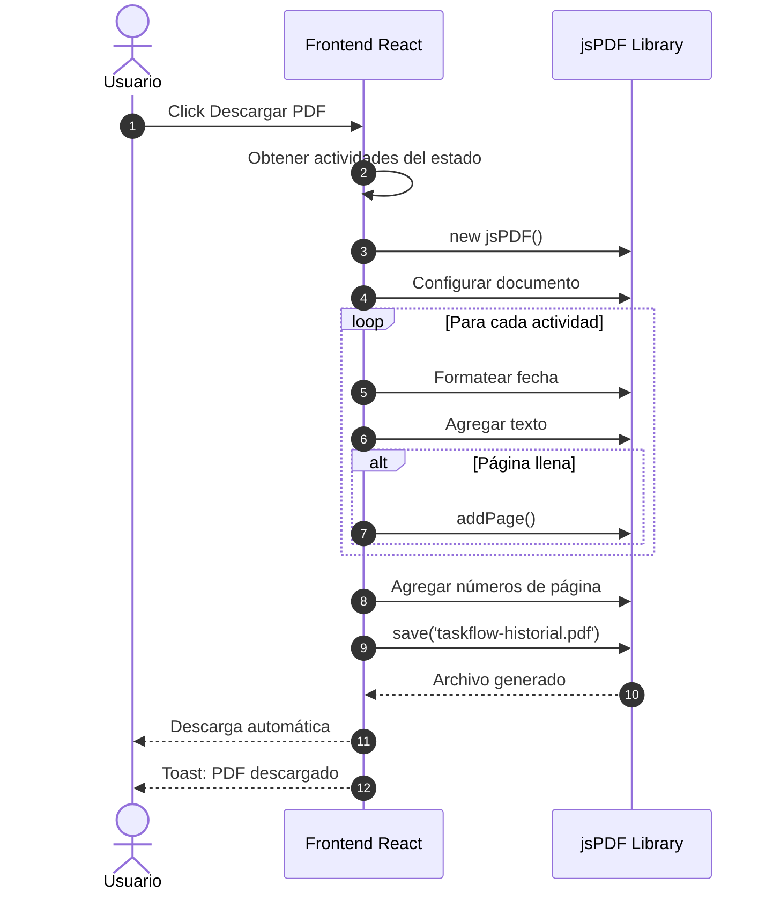
```mermaid
sequenceDiagram
    autonumber
    actor U as Usuario
    participant F as Frontend React
    participant PDF as jsPDF Library

    U->>F: Click Descargar PDF
    F->>F: Obtener actividades del estado
    F->>PDF: new jsPDF()
    F->>PDF: Configurar documento
    
    loop Para cada actividad
        F->>PDF: Formatear fecha
        F->>PDF: Agregar texto
        
        alt Página llena
            F->>PDF: addPage()
        end
    end
    
    F->>PDF: Agregar números de página
    F->>PDF: save('taskflow-historial.pdf')
    PDF-->>F: Archivo generado
    F-->>U: Descarga automática
    F-->>U: Toast: PDF descargado
```

---

# 4.5 DICCIONARIO DE DATOS

## Colección: users

| Campo | Tipo | Tamaño | Requerido | Único | Descripción | Ejemplo |
|-------|------|--------|-----------|-------|-------------|---------|
| id | String | 36 | Sí | Sí | Identificador UUID v4 | "550e8400-e29b-41d4-a716-446655440000" |
| email | String | 255 | Sí | Sí | Correo electrónico | "estudiante@unphu.edu.do" |
| password | String | 60 | Sí | No | Hash bcrypt de contraseña | "$2b$12$LQv3c1yqBWVHxkd0LHAkCOYz6TtxMQJqhN8/X4.V5C5QJZXYZ" |
| name | String | 100 | Sí | No | Nombre completo del usuario | "Juan Pérez" |
| points | Integer | - | Sí | No | Puntos acumulados para rango | 150 |
| redeemable_points | Integer | - | Sí | No | Puntos canjeables disponibles | 75 |
| unlocked_avatars | Array | - | No | No | IDs de avatares desbloqueados | ["owl_basic", "owl_glasses"] |
| current_avatar | String | 50 | No | No | ID del avatar seleccionado | "owl_basic" |
| created_at | String | 30 | Sí | No | Fecha ISO 8601 de registro | "2025-01-15T10:30:00Z" |

## Colección: tasks

| Campo | Tipo | Tamaño | Requerido | Único | Descripción | Ejemplo |
|-------|------|--------|-----------|-------|-------------|---------|
| id | String | 36 | Sí | Sí | Identificador UUID v4 | "660e8400-e29b-41d4-a716-446655440001" |
| user_id | String | 36 | Sí | No | FK a users.id | "550e8400-e29b-41d4-a716-446655440000" |
| title | String | 200 | Sí | No | Título de la tarea | "Entregar proyecto final" |
| description | String | 1000 | No | No | Descripción detallada | "Incluir documentación y código fuente" |
| due_date | String | 10 | Sí | No | Fecha límite YYYY-MM-DD | "2025-02-15" |
| due_time | String | 5 | No | No | Hora límite HH:MM | "23:59" |
| status | String | 20 | Sí | No | Estado de la tarea | "pending" \| "completed" \| "incomplete" |
| created_at | String | 30 | Sí | No | Fecha de creación | "2025-01-10T08:00:00Z" |
| updated_at | String | 30 | Sí | No | Última modificación | "2025-01-12T14:30:00Z" |

## Colección: future_plans

| Campo | Tipo | Tamaño | Requerido | Único | Descripción | Ejemplo |
|-------|------|--------|-----------|-------|-------------|---------|
| id | String | 36 | Sí | Sí | Identificador UUID v4 | "770e8400-e29b-41d4-a716-446655440002" |
| user_id | String | 36 | Sí | No | FK a users.id | "550e8400-e29b-41d4-a716-446655440000" |
| title | String | 200 | Sí | No | Título del plan/meta | "Graduarme con honores" |
| description | String | 2000 | No | No | Descripción de la meta | "Mantener índice superior a 3.5" |
| target_date | String | 10 | No | No | Fecha objetivo | "2026-06-30" |
| created_at | String | 30 | Sí | No | Fecha de creación | "2025-01-05T12:00:00Z" |

## Colección: activities

| Campo | Tipo | Tamaño | Requerido | Único | Descripción | Ejemplo |
|-------|------|--------|-----------|-------|-------------|---------|
| id | String | 36 | Sí | Sí | Identificador UUID v4 | "880e8400-e29b-41d4-a716-446655440003" |
| user_id | String | 36 | Sí | No | FK a users.id | "550e8400-e29b-41d4-a716-446655440000" |
| action | String | 50 | Sí | No | Tipo de acción realizada | "task_completed" |
| description | String | 500 | Sí | No | Descripción legible | "Completed task: Entregar proyecto" |
| points_earned | Integer | - | Sí | No | Puntos ganados (0 si no aplica) | 10 |
| created_at | String | 30 | Sí | No | Fecha de la actividad | "2025-01-12T14:30:00Z" |

### Valores permitidos para action:
- `register` - Usuario se registró
- `login` - Usuario inició sesión
- `task_created` - Tarea creada
- `task_completed` - Tarea completada
- `task_deleted` - Tarea eliminada
- `task_status_changed` - Estado de tarea cambiado
- `plan_created` - Plan futuro creado
- `plan_deleted` - Plan futuro eliminado
- `avatar_unlocked` - Avatar desbloqueado

## Constante: AVATARS

| ID | Nombre | Precio | Imagen |
|----|--------|--------|--------|
| owl_basic | Búho Estudiante | 500 | 🦉 |
| owl_glasses | Búho Intelectual | 600 | 🦉 |
| owl_graduate | Búho Graduado | 1000 | 🎓 |
| owl_golden | Búho Dorado | 2000 | 👑 |

## Constante: RANKS

| Nombre | Puntos Mínimos | Color | Icono |
|--------|----------------|-------|-------|
| Procrastinador | 0 | gray | Coffee |
| Freshman | 300 | emerald | Sprout |
| Sophomore | 500 | blue | BookOpen |
| Business Man | 800 | purple | Briefcase |
| Soldier | 1200 | yellow | Shield |

---

# 4.6 DISEÑO DE PANTALLAS

## Wireframe: Pantalla de Login

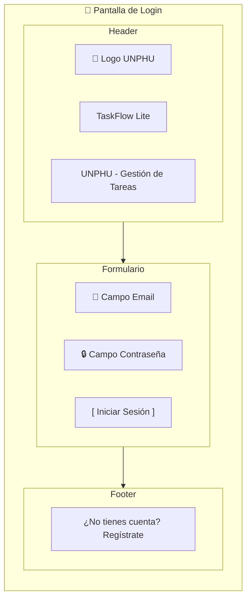
```mermaid
flowchart TD
    subgraph Login["📱 Pantalla de Login"]
        direction TB
        
        subgraph Header["Header"]
            LOGO[🦉 Logo UNPHU]
            TITLE["TaskFlow Lite"]
            SUBTITLE["UNPHU - Gestión de Tareas"]
        end
        
        subgraph Form["Formulario"]
            EMAIL["📧 Campo Email"]
            PASS["🔒 Campo Contraseña"]
            BTN["[ Iniciar Sesión ]"]
        end
        
        subgraph Footer["Footer"]
            LINK["¿No tienes cuenta? Regístrate"]
        end
        
        Header --> Form
        Form --> Footer
    end
```

## Wireframe: Dashboard

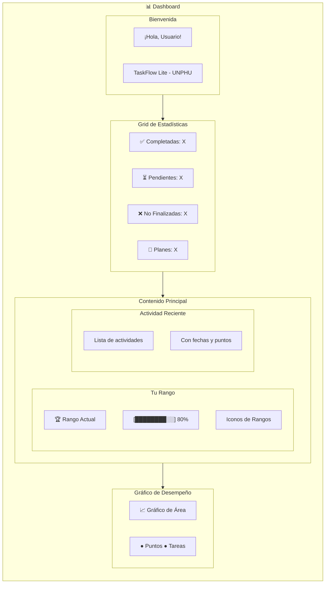
```mermaid
flowchart TD
    subgraph Dashboard["📊 Dashboard"]
        direction TB
        
        subgraph Welcome["Bienvenida"]
            HELLO["¡Hola, Usuario!"]
            SUB["TaskFlow Lite - UNPHU"]
        end
        
        subgraph Stats["Grid de Estadísticas"]
            direction LR
            S1["✅ Completadas: X"]
            S2["⏳ Pendientes: X"]
            S3["❌ No Finalizadas: X"]
            S4["🎯 Planes: X"]
        end
        
        subgraph Content["Contenido Principal"]
            direction LR
            subgraph Rank["Tu Rango"]
                R1["🏆 Rango Actual"]
                R2["[████████░░] 80%"]
                R3["Iconos de Rangos"]
            end
            subgraph Activity["Actividad Reciente"]
                A1["Lista de actividades"]
                A2["Con fechas y puntos"]
            end
        end
        
        subgraph Chart["Gráfico de Desempeño"]
            GRAPH["📈 Gráfico de Área"]
            LEGEND["● Puntos  ● Tareas"]
        end
        
        Welcome --> Stats
        Stats --> Content
        Content --> Chart
    end
```

## Wireframe: Lista de Tareas

```mermaid
flowchart TD
    subgraph Tasks["📋 Página de Tareas"]
        direction TB
        
        subgraph Header["Header"]
            TITLE["Mis Tareas"]
            FILTER["[ Filtrar ▼ ]"]
            NEW["[ + Nueva Tarea ]"]
        end
        
        subgraph TaskList["Lista de Tareas"]
            subgraph T1["Tarea 1"]
                CHECK1["○"]
                INFO1["Título + Descripción"]
                DATE1["📅 Fecha"]
                MENU1["⋮"]
            end
            subgraph T2["Tarea 2"]
                CHECK2["✓"]
                INFO2["Título + Descripción"]
                DATE2["📅 Fecha"]
                MENU2["⋮"]
            end
            subgraph T3["Tarea 3"]
                CHECK3["✗"]
                INFO3["Título + Descripción"]
                DATE3["📅 Fecha"]
                MENU3["⋮"]
            end
        end
        
        Header --> TaskList
    end
```

## Wireframe: Modal Crear Tarea

```mermaid
flowchart TD
    subgraph Modal["🆕 Modal Nueva Tarea"]
        direction TB
        
        CLOSE["✕"]
        MTITLE["Nueva Tarea"]
        
        subgraph Fields["Campos"]
            F1["Título *"]
            F2["Descripción"]
            subgraph DateTime["Fecha y Hora"]
                F3["📅 Seleccionar Fecha"]
                F4["🕐 Seleccionar Hora"]
            end
        end
        
        subgraph Actions["Acciones"]
            BTN1["[ Cancelar ]"]
            BTN2["[ Crear ]"]
        end
        
        MTITLE --> Fields
        Fields --> Actions
    end
```

## Wireframe: Página de Perfil

```mermaid
flowchart TD
    subgraph Profile["👤 Página de Perfil"]
        direction TB
        
        subgraph UserInfo["Información de Usuario"]
            direction LR
            AVATAR["🦉 Avatar Actual"]
            subgraph Details["Detalles"]
                NAME["Nombre Usuario"]
                EMAIL["email@unphu.edu.do"]
                POINTS["🏆 150 pts rango | 💰 75 pts canjeables"]
            end
        end
        
        subgraph Shop["🛒 Tienda de Avatares"]
            direction LR
            subgraph A1["Avatar 1"]
                IMG1["🦉"]
                N1["Búho Estudiante"]
                P1["500 pts"]
                B1["[ Desbloquear ]"]
            end
            subgraph A2["Avatar 2"]
                IMG2["🦉"]
                N2["Búho Intelectual"]
                P2["600 pts"]
                B2["[ 🔒 525 más ]"]
            end
            subgraph A3["Avatar 3"]
                IMG3["🎓"]
                N3["Búho Graduado"]
                P3["1000 pts"]
                B3["[ 🔒 925 más ]"]
            end
            subgraph A4["Avatar 4"]
                IMG4["👑"]
                N4["Búho Dorado"]
                P4["2000 pts"]
                B4["[ 🔒 1925 más ]"]
            end
        end
        
        subgraph Info["ℹ️ Información"]
            TIP["Completa tareas para ganar +5 pts canjeables"]
        end
        
        UserInfo --> Shop
        Shop --> Info
    end
```

## Wireframe: Sidebar/Navegación

```mermaid
flowchart TD
    subgraph Sidebar["📱 Sidebar"]
        direction TB
        
        subgraph Logo["Logo"]
            SLOGO["🦉 TaskFlow Lite"]
            SSUB["UNPHU"]
        end
        
        subgraph User["Usuario"]
            UAVATAR["Avatar"]
            UNAME["Nombre"]
            UEMAIL["Email"]
            UPOINTS["🏆 Pts | Rango"]
            UREDEEMABLE["💰 Canjeables"]
        end
        
        subgraph Nav["Navegación"]
            N1["📊 Dashboard"]
            N2["📋 Tareas"]
            N3["📜 Historial"]
            N4["🎯 Planes Futuros"]
            N5["👤 Mi Perfil"]
        end
        
        subgraph Bottom["Inferior"]
            THEME["🌙 Modo Claro/Oscuro"]
            LOGOUT["🚪 Cerrar Sesión"]
        end
        
        Logo --> User
        User --> Nav
        Nav --> Bottom
    end
```

## Estructura de Colores (Modo Oscuro)

```mermaid
flowchart LR
    subgraph Colors["🎨 Paleta de Colores - Modo Oscuro"]
        BG["Background: #0a1a0a"]
        CARD["Cards: rgba(10,26,10,0.8)"]
        PRIMARY["Primary: #10B981 (Emerald)"]
        ACCENT["Accent: #34D399 (Light Emerald)"]
        TEXT["Text: #F8FAFC"]
        MUTED["Muted: #94A3B8"]
        BORDER["Border: rgba(16,185,129,0.2)"]
    end
```

## Estructura de Colores (Modo Claro)

```mermaid
flowchart LR
    subgraph ColorsLight["🎨 Paleta de Colores - Modo Claro"]
        BGL["Background: #F8FAF8"]
        CARDL["Cards: rgba(255,255,255,0.9)"]
        PRIMARYL["Primary: #059669 (Emerald 600)"]
        ACCENTL["Accent: #10B981"]
        TEXTL["Text: #0F172A"]
        MUTEDL["Muted: #64748B"]
        BORDERL["Border: rgba(16,185,129,0.3)"]
    end
```

---

# INSTRUCCIONES DE USO

## Visualizar los Diagramas

1. **Mermaid Live Editor (Recomendado)**
   - Ir a https://mermaid.live/
   - Pegar el código del diagrama
   - Ver resultado instantáneo
   - Exportar como PNG o SVG

2. **VS Code**
   - Instalar extensión "Markdown Preview Mermaid Support"
   - Abrir este archivo .md
   - Presionar Ctrl+Shift+V para preview

3. **GitHub/GitLab**
   - Subir archivo .md al repositorio
   - GitHub renderiza Mermaid automáticamente

4. **Notion**
   - Crear bloque de código con lenguaje "mermaid"
   - Pegar el código

---

**Documento generado para TaskFlow Lite - UNPHU**
**Universidad Nacional Pedro Henríquez Ureña**
**Escuela de Informática - 2025**
